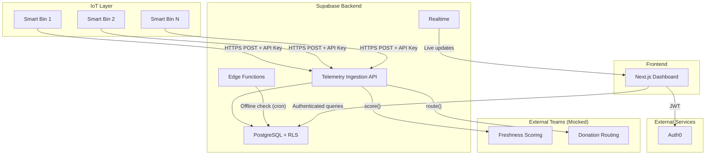

# Architecture

> Smart Cycle — B2B Smart Food Waste Prevention Platform

---

## System Overview

---

## Tech Stack

| Layer | Technology | Purpose |
|---|---|---|
| **Database** | Supabase PostgreSQL | Relational data + time-series telemetry |
| **Auth** | Auth0 | User authentication, RBAC, JWT issuance |
| **Backend** | Supabase Edge Functions + Node.js/TS | Serverless logic, telemetry ingestion |
| **Frontend** | Next.js + Tailwind CSS | Store manager & food bank dashboards |
| **Realtime** | Supabase Realtime | Live bin status and alert updates |
| **IoT Auth** | Per-bin API keys | Authenticate bin telemetry POST requests |

---

## Key Architectural Decisions

| Decision | Rationale |
|---|---|
| **Supabase over raw PostgreSQL** | Managed hosting, built-in RLS, Realtime, Edge Functions, PostgREST API |
| **Auth0 over Supabase Auth** | Enterprise SSO support, advanced RBAC, team already familiar |
| **Mock functions for scoring/routing** | Owned by external teams; we define contracts and stub implementations |
| **Per-bin API keys** | Fine-grained revocation, rotation without affecting other bins |
| **RLS on all tables** | Multi-tenant security enforced at the database level |
| **Functional pure-function pipeline** | Testable, composable telemetry processing |

---

## Security Model

1. **IoT → API:** Per-bin API key in `Authorization: Bearer <key>` header. Key hash stored in `bins.api_key_hash`.
2. **User → Dashboard:** Auth0 JWT. Validated by middleware. Roles embedded in JWT claims.
3. **Dashboard → Database:** Supabase client with RLS. Users only see data from their `organization_id`.
4. **Service operations:** Supabase service role key (bypasses RLS) for telemetry ingestion and background jobs.
