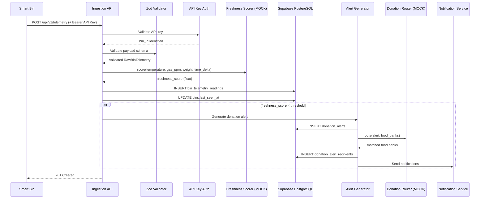
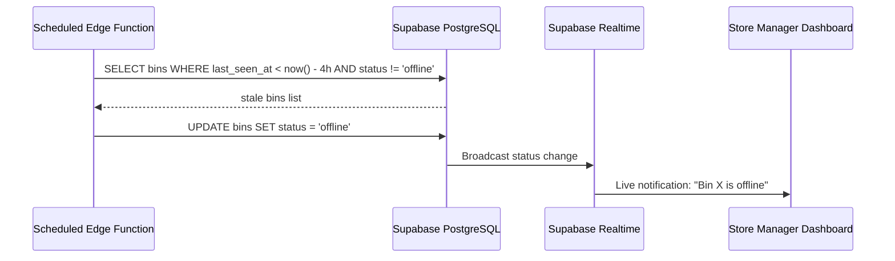

# Data Flow

> End-to-end flow from IoT bin → Supabase → Alert → Food Bank

---

## Telemetry Ingestion Flow

---

## Offline Detection Flow

---

## Pipeline Stages

Each stage is a **pure function** (except persist & notify):

| Stage | Input | Output | Side Effects? |
|---|---|---|---|
| **Validate** | Raw JSON payload | `RawBinTelemetry` | No |
| **Authenticate** | API key + bin_id | Confirmed bin identity | No |
| **Score** | Telemetry readings | `freshness_score` | No (MOCK) |
| **Decide** | Score + thresholds | Alert or no-alert | No |
| **Persist** | Validated + scored reading | DB row | Yes — DB write |
| **Route** | Alert + food banks | Matched recipients | No (MOCK) |
| **Notify** | Recipients | Emails/webhooks sent | Yes — external calls |
