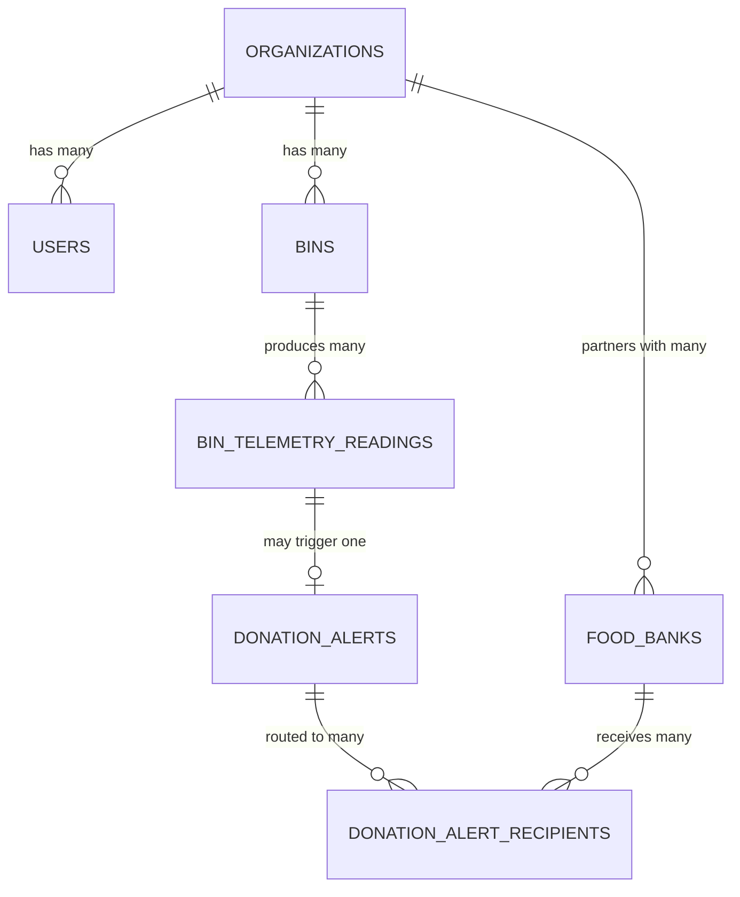

# Database Documentation

> Supabase PostgreSQL. RLS enabled on all tables. See the [full schema outline](../../../.gemini/antigravity/brain/872e8774-1e8f-479f-927b-fb2a7be848ed/database_schema_outline.md) artifact for column-level detail.

---

## Tables Overview

| Table | Purpose | Volume |
|---|---|---|
| `organizations` | Grocery store chains / companies | Low |
| `users` | Dashboard users (admin, store manager, food bank coordinator) | Low |
| `bins` | Registered IoT smart bins | Medium |
| `bin_telemetry_readings` | Time-series sensor data (every 2 hrs per bin) | **High** |
| `food_banks` | Local food banks that receive donation alerts | Low |
| `donation_alerts` | Alerts triggered when food approaches waste threshold | Medium |
| `donation_alert_recipients` | Join table: which food banks received which alerts | Medium |

---

## Relationships

---

## Key Design Decisions

| Decision | Rationale |
|---|---|
| UUIDs for all PKs | Avoids sequential ID enumeration; works well with Supabase |
| `bins.last_seen_at` denormalization | Fast offline detection without scanning telemetry table |
| `bins.api_key_hash` | Per-bin auth; raw key shown once at registration |
| `users.auth0_id` | Maps Auth0 identity to local user record |
| Composite index `(bin_id, recorded_at)` | Optimizes time-range telemetry queries |
| `freshness_score` nullable | Computed asynchronously after ingestion |

---

## RLS Policies (Summary)

| Table | Policy |
|---|---|
| All tables | `organization_id` scoping for authenticated users |
| `bin_telemetry_readings` | Service role key bypasses RLS for ingestion |
| `bins` | Admins can write; store managers can read |
| `donation_alerts` | Readable by all org roles |
| `donation_alert_recipients` | Food bank coordinators can update `response` |

---

## Migration History

*Will be updated as migrations are applied.*

| Version | Name | Date | Description |
|---|---|---|---|
| — | — | — | No migrations applied yet |
